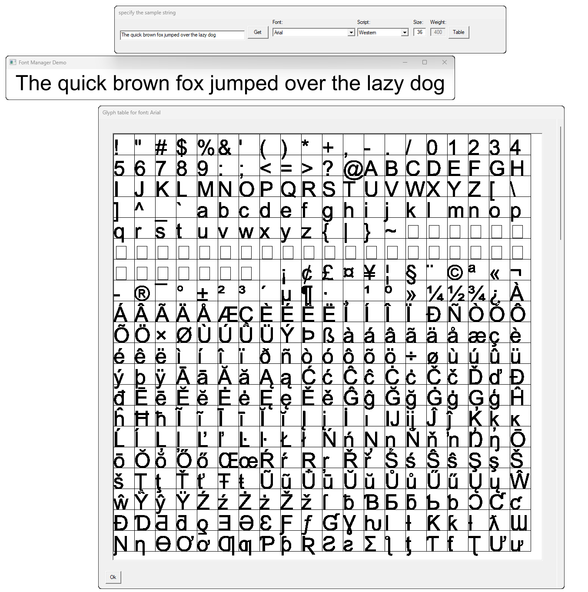

# Understanding the EnVisioNateSW FontManager system with additional help with the EnVisioNateSW Renderer 

>All of my repositories need the [Common](https://github.com/ntclark/Common) repository and there you will find clear 
build instructions for all of them.

This project will help you see how the FontManager works and how you might utilize it in your own 
software projects.

The FontManager is very simple to use, you should be able to take the solution or projects in it from this
repository and build the artifacts you'll need to render text. From there, you can see how easy it would be to 
implement font rendering in your system.

**Note:** Please remember that the font manager is about rendering glyphs on a screen (window in your application), on 
bitmaps, or on your printer. Specifically, it does not help you in laying out text, with, for example, tools to help with 
kerning or justification. However, it does offer everything about font (glyph) metrics with which you can implement those
techniques yourself, if that is important for your application.

Here's the font manager in action, we are looking at the Arial font, size 36 points and it has rendered the given sentence.
I've clicked the table button to show every glyph defined the font in a grid pattern. 

