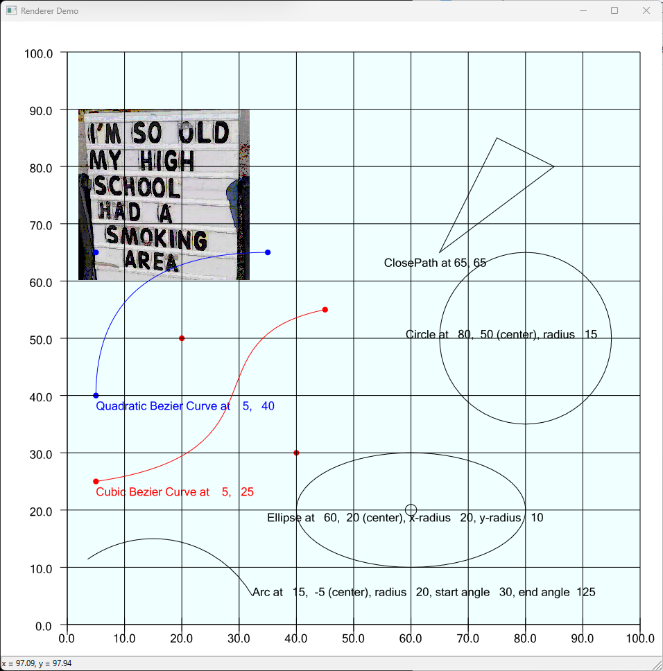

# The EnVisioNateSW Renderer

>All of my repositories need the [Common](https://github.com/ntclark/Common) repository. There you will find clear 
build instructions for all of them.

This component of the system affects the visual representation of everything in the system that is visual.

In other words, nowhere else is there any code that calls the Windows GDI or Direct2D components 
to show entities on the screen (or any Device Context).

At one point, this component simply rendered text on behalf of the [Font Manager](../EnVisioNateSW_FontManager) however, 
it evolved to handle all lines, shapes, and images for all components of the system.

As a COM compnent, you can instantiate this from any software system you might want to generate graphics in. 
It has a simple COM interface and an elegant and flexible implementation pattern that you could easily expand 
when your needs exceed those of this repository. In addition, you need not be an expert in the MS graphics 
systems to utlize this component.

I've built a simple demo project to show how easy it is to use this component to put graphics in your 
own system. 

The demo is a windows application that hosts this project as a COM component and creates each of the typical graphics 
primitives in a clean and robust way. You can see immediately how easy, and flexible, this component really is for
rendering graphics. Which includes all manner of text right away (the demo also shows the use of the 
[Font Manager](../EnVisioNateSW_FontManager/Readme.md) object).

To get started with the demo, please go [here](./rendererDemo/Readme.md).

