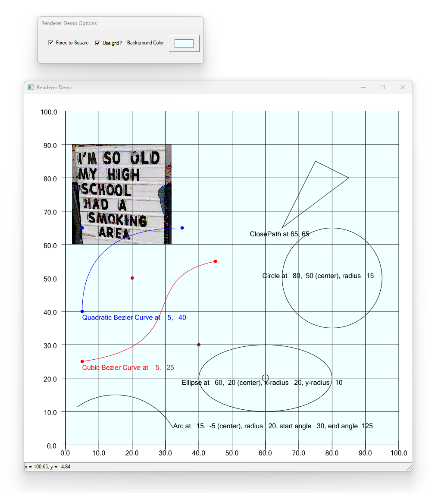

# How easy is it to use the Renderer ?

## A Whole Lot of Easy !

This demo is the simplest of Windows applications. For demonstrating the easiest way to create a
windows application using the raw Windows API - the demo will also take the mysteries out of that.

The intent of the demo, though, is to show you how to embed the Renderer Object onto a window 
and begin drawing graphics on it right away.

The demo is a simple Overlapped window, which is just a frame, a caption, and a client all rolled into one.

### NOT a visual object !

What was that ?? This is not really a visual object ? Well, there's all of stuff in the image below
that seems to counter that theory !

But let me explain, this object draws on *your** window ! That is an important distinction. In other words
this object does NOT create a surface (window and device context) of it's own. I have written a number
of COM objects that use the OleObject, etc., family of COM interfaces in order to be used as an "embedded" visual
object. 

No, that is **not** the case here, that's approach can be way too complicated, and frankly, less powerful. You'll see why I think later on.

Indeed, there is no real connection between this object and *any* actual window in your software. The *only* connection is through a 
device context. And this can be **any** device context from any window in your system, **OR** to a printer, **OR** to a bitmap. yes, 
you can use this COM component simply to create bitmaps. Maybe it does not not even need be visual in your system.

Like I've said, this is a simple as possible, yet powerful and hopefully very useful in your projects.

### A bit of history, skip if you want

This project actually came about as I was building my [PostScript Interpreter](../../PostScriptInterpreter) project. Font handling in that
project had been delegated to my [Font Manager](../../EnVisioNateSW_FontManager) and *that* became a valuable product in it's own right.

BUt I struggled to find an unerstandable example of rasterizing fonts. I spent a few weeks with freetype, but ultimately I gave up 
and started looking for either a) a decent explanation and example of rasterizing theory, or b) a *native* implemenation built-in to the 
Windows API. I have no qualms using something from an Operating System - that is, after all, what Operating Systems are for, the more
complete of them should expose those technologies that they obviously have within them for all of us to use.

Though it alluded me at first, I discovered that Direct2D can rasterize the fonts glyph contours I was producing perfectly, down to the 
smallest of sizes. Though this seems obvious, the API documentation steered me to DWrite - which I **don't** want. I'd already unraveled 
the incredibly complex world of fonts and glyph geometries, no way I would throw that away. So I marched onward.

I was getting really horrible rasterizing results at small sizes though for a long time. *Finally* I realized I had to upscale the glyph 
geometries while building up the graphics, and downscale them at rendering time. Presumable because of loss of precision by the use of FLOATs 
that the Direct2D world uses - a huge mistake in my opinion.

## Direct2D without the lerning curve

So Direct2D became the perfect solution to getting excellent rasterization of my fonts. I realized at that point that I should 
create a universal graphics rendering engine for **all** graphics primitives. Not only for just font rasterization, but also for ALL
PostScript drawing commands - of course independent of PostScript itself. Therefore, the EnVisioNatesSW_Renderer was born.

And it became on of the more powerful, and hopefully useful of the three projects in this repository - which include the 
[PostScript Interpreter](../../PostScriptInterpreter) and [Font Manager](../../EnVisioNateSW_FontManager).

The following figure shows the demo in action. 

When you ubild and run this demo, try grabbing the corner of the big window and click and resize.

Did you notice that the entire figure scales 100% automatically ?

You don't have to have it do this, maybe it's not in a resizable window, but achieving that effect is automatic and requires
literally zero lines of code to accomplish.

Note one other thing, the window with the graphic on it is **not** owned or created by this COM object. As mentioned in the 
introduction above. That is far easier than having an embedded object, like an ActiveX Control. In the future I might make one
but at this point it is so simple to "integrate" into your, or any, application, I don't want to muddy the waters.

